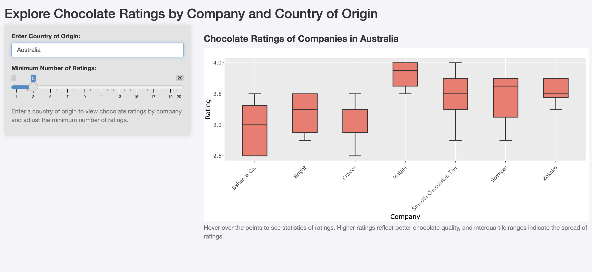

```{r, include = FALSE}
knitr::opts_chunk$set(
  collapse = TRUE,
  comment = "#>"
)
```

# Introduction

This vignette demonstrates how to use the ChocoRatingPackage to explore chocolate ratings data and visualize it using a Shiny app.

# Loading the Data

After installing and loading the package, you can access the `chocolate_rating` dataset, which contains the cleaned chocolate rating data:

```{r}
library(ChocoRatingPackage)

# Load the dataset
data(chocolate_rating)

# View the first few rows of the dataset
head(chocolate_rating)
```

# Using the `explore_ratings` Function

The `explore_ratings()` function launches an interactive Shiny app to visualize chocolate ratings by company and country of origin. Users can specify a country and set a minimum number of ratings for companies included in the analysis.

```{r, eval=FALSE}
explore_ratings()
```

Below is an example of the output generated by the `explore_ratings()` function when viewing ratings for companies in Australia:

{width=650px}
